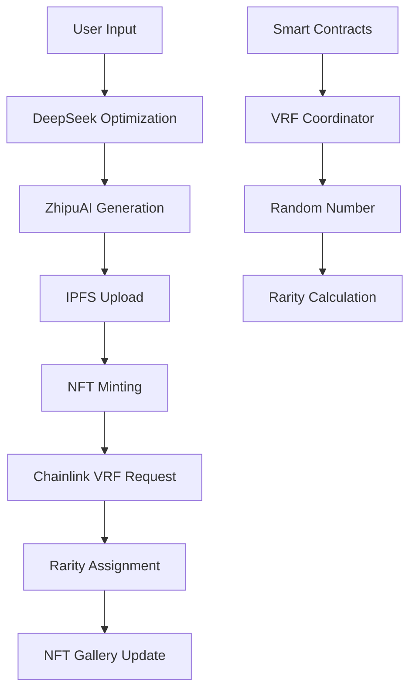

# 🐉 ShanHaiVerse - Divine Image Project

> **Building the Future, Onchain** - AI-Powered Mythical Beast Creation Platform with Chainlink VRF

[](https://docs.chain.link/vrf)
[](https://platform.deepseek.com/)
[](https://pinata.cloud/)
[](https://sepolia.etherscan.io/)

## 🚀 Live Demo

**Experience the platform now:** [https://shanhaiproject-bej418z2o-tzuyus-projects-2d9d237b.vercel.app](https://shanhaiproject-bej418z2o-tzuyus-projects-2d9d237b.vercel.app)

Connect your MetaMask wallet to Sepolia Testnet and start creating your AI-generated mythical beasts!

---

## 🎯 Chromion Hackathon Submission

This project is submitted for the **Chromion: A Chainlink Hackathon** (May 30 - June 29, 2025), showcasing innovative use cases that combine **DeFi**, **Tokenized Assets**, and **AI**.

### 🏆 Hackathon Compliance

- ✅ **Chainlink VRF Integration**: Core smart contract functionality for provably fair rarity assignment
- ✅ **Blockchain State Changes**: NFT minting with on-chain randomness
- ✅ **Complete AI + Web3 Solution**: Bridging AI generation with blockchain permanence
- ✅ **Innovative Use Case**: Cultural heritage meets cutting-edge technology
- ✅ **Public Repository**: Full source code available
- ✅ **Live Demo**: Deployed and functional on Sepolia

---

## 📖 Project Overview

**ShanHaiVerse** reimagines ancient Chinese mythology through the lens of modern AI and blockchain technology. Users describe mythical beasts from the classic text "Shan Hai Jing" (Classic of Mountains and Seas), and our AI generates unique artwork that is minted as NFTs with **provably fair rarity** using **Chainlink VRF**.

### 🌟 Key Features

- **AI-Powered Generation**: DeepSeek for prompt optimization + ZhipuAI for image creation
- **Chainlink VRF Rarity**: Tamper-proof, verifiable randomness for fair rarity distribution
- **IPFS Storage**: Permanent, decentralized storage via Pinata
- **Cultural Bridge**: Connecting 3000+ year old mythology with Web3 innovation
- **Complete UX**: From creation to gallery, fully integrated user experience

---

## 🔗 Chainlink Integration Details

### Core VRF Implementation

Our smart contracts use **Chainlink VRF v2** to ensure provably fair rarity assignment:

```solidity
// Key files using Chainlink:
├── contracts/PromptNFT.sol           // Main NFT contract with VRF integration
├── contracts/VRFConsumer.sol         // VRF randomness consumer
└── src/hooks/useContract.ts          // Frontend VRF interaction
```

**VRF Configuration (Sepolia):**
- **Coordinator**: `0x9DdfaCa8183c41ad55329BdeeD9F6A8d53168B1B`
- **Key Hash**: `0x787d74caea10b2b357790d5b5247c2f63d1d91572a9846f780606e4d953677ae`
- **Subscription ID**: `11978318525222896027773046731460179890031671972527309000293301562433571167752`

### How VRF Ensures Fairness

1. **User Mints NFT** → Smart contract requests randomness from Chainlink VRF
2. **VRF Callback** → Chainlink nodes provide verifiable random number
3. **Rarity Assignment** → Random number mapped to rarity tiers (0-4)
4. **Transparent Process** → All randomness is verifiable on-chain

**Rarity Distribution:**
- Common (60%): Everyday mythical beasts
- Rare (25%): Special creatures with unique traits  
- Epic (10%): Legendary beasts with enhanced abilities
- Legendary (4%): Mythical creatures of great power
- Mythical (1%): Extremely rare, divine-tier beasts

---

## 🛠 Technology Stack

### Frontend
- **Next.js 14** - React framework with App Router
- **TypeScript** - Type-safe development
- **Tailwind CSS** - Utility-first styling
- **Wagmi + Viem** - Ethereum interaction libraries

### AI Integration
- **DeepSeek API** - Advanced prompt optimization
- **ZhipuAI CogView-3** - High-quality image generation
- **Smart Prompt Engineering** - Cultural context preservation

### Blockchain
- **Ethereum Sepolia** - Testnet deployment
- **Chainlink VRF v2** - Verifiable randomness
- **Solidity Smart Contracts** - NFT + VRF implementation
- **MetaMask Integration** - Wallet connectivity

### Storage & Infrastructure
- **Pinata IPFS** - Decentralized metadata and image storage
- **Vercel** - Frontend deployment and hosting
- **PostgreSQL** - User data and NFT metadata indexing

---

## 🏗 Architecture Overview



---

## 🚀 Local Development Setup

### Prerequisites

- Node.js 18+ 
- npm or yarn
- MetaMask browser extension
- Sepolia ETH for testing

### Installation Steps

1. **Clone the repository**
```bash
git clone https://github.com/zhouziyu12/shanhaiproject.git
cd shanhaiproject
```

2. **Install dependencies**
```bash
npm install
# or
yarn install
```

3. **Create environment file**
```bash
cp .env.example .env.local
```

4. **Configure your `.env.local` file:**

```bash
# ========== Blockchain Configuration ==========
NEXT_PUBLIC_SHT_TOKEN_ADDRESS=0xDd0C2E81D9134A914fcA7Db9655d9813C87D5701
NEXT_PUBLIC_PROMPT_NFT_ADDRESS=0x9269C7b6BFe45143f899fdA45d5ba2C7aDD0367A
NEXT_PUBLIC_MARKETPLACE_ADDRESS=0x62c6FE18490398e9b77E6e1294D046e16bE1aEC4

# Network Configuration - Sepolia Testnet
NEXT_PUBLIC_CHAIN_ID=11155111
NEXT_PUBLIC_RPC_URL=https://sepolia.infura.io/v3/YOUR_INFURA_KEY
NEXT_PUBLIC_INFURA_API_KEY=YOUR_INFURA_KEY

# Wallet Connection
NEXT_PUBLIC_WALLETCONNECT_PROJECT_ID=YOUR_WALLETCONNECT_PROJECT_ID

# ========== AI Service Configuration ==========
# Get your API keys from respective platforms
NEXT_PUBLIC_DEEPSEEK_API_KEY=sk-your-deepseek-api-key
DEEPSEEK_API_URL=https://api.deepseek.com

NEXT_PUBLIC_ZHIPU_API_KEY=your-zhipu-api-key
ZHIPU_API_URL=https://open.bigmodel.cn

# ========== IPFS Configuration ==========
# Get your Pinata credentials from pinata.cloud
PINATA_API_KEY=your-pinata-api-key
PINATA_SECRET_API_KEY=your-pinata-secret-key
PINATA_JWT=your-pinata-jwt-token

# ========== VRF Configuration ==========
# For testing purposes - use Sepolia testnet
VRF_SUBSCRIPTION_ID=your-vrf-subscription-id
VRF_COORDINATOR_ADDRESS=0x9DdfaCa8183c41ad55329BdeeD9F6A8d53168B1B
VRF_KEY_HASH=0x787d74caea10b2b357790d5b5247c2f63d1d91572a9846f780606e4d953677ae

# ========== Application Settings ==========
NEXT_PUBLIC_APP_NAME=ShanHaiVerse
NEXT_PUBLIC_APP_DESCRIPTION=AI-Powered Mythical Beast Creation Platform
DATABASE_URL=your-postgresql-connection-string
```

5. **Set up API Keys (Required for full functionality):**

   **DeepSeek API** (Prompt Optimization):
   - Visit [platform.deepseek.com](https://platform.deepseek.com)
   - Create account and get API key
   - Add to `NEXT_PUBLIC_DEEPSEEK_API_KEY`

   **ZhipuAI API** (Image Generation):
   - Visit [open.bigmodel.cn](https://open.bigmodel.cn)  
   - Register and obtain API key
   - Add to `NEXT_PUBLIC_ZHIPU_API_KEY`

   **Pinata IPFS** (Storage):
   - Sign up at [pinata.cloud](https://pinata.cloud)
   - Get API keys from dashboard
   - Add credentials to respective variables

   **Infura** (Ethereum RPC):
   - Create project at [infura.io](https://infura.io)
   - Get project ID for Sepolia
   - Add to `NEXT_PUBLIC_INFURA_API_KEY`

6. **Run the development server**
```bash
npm run dev
# or
yarn dev
```

7. **Access the application**
   - Open [http://localhost:3000](http://localhost:3000)
   - Connect MetaMask to Sepolia Testnet
   - Get Sepolia ETH from [faucet](https://sepoliafaucet.com/)

---

## 🧪 Testing Guide

### Live Demo Testing

1. **Visit**: [https://shanhaiproject-bej418z2o-tzuyus-projects-2d9d237b.vercel.app](https://shanhaiproject-bej418z2o-tzuyus-projects-2d9d237b.vercel.app)

2. **Setup MetaMask for Sepolia:**
   - Network Name: Sepolia Test Network
   - RPC URL: `https://sepolia.infura.io/v3/`
   - Chain ID: 11155111
   - Currency Symbol: ETH
   - Block Explorer: https://sepolia.etherscan.io

3. **Get Test ETH:**
   - Visit [Sepolia Faucet](https://sepoliafaucet.com/)
   - Request test ETH for your wallet address

4. **Test Complete Workflow:**
   - Connect wallet → Create mythical beast → Generate AI art → Mint NFT → Watch VRF rarity assignment → View in gallery

### Local Testing

```bash
# Run tests
npm run test

# Build for production
npm run build

# Type checking
npm run type-check

# Linting
npm run lint
```

---

## 🎨 User Journey

### 1. **AI Creation Workshop**
- User describes mythical beast in natural language
- DeepSeek optimizes prompt for better AI generation
- ZhipuAI creates unique artwork based on description
- Multiple art styles available (Classical Ink, Modern, Fantasy, Ink Wash)

### 2. **NFT Minting Process**
- Artwork uploaded to IPFS via Pinata
- Smart contract minting with integrated Chainlink VRF request
- Transparent rarity assignment using verifiable randomness
- SHT token rewards for participation

### 3. **Gallery & Collection**
- View all owned mythical beasts
- Filter by rarity, style, and search functionality
- Share creations with community
- Track collection statistics and value

---

## 🔒 Smart Contract Security

### VRF Implementation Security

- **Randomness Source**: Chainlink VRF provides cryptographically secure randomness
- **No Manipulation**: Contract owner cannot influence rarity outcomes
- **Transparent Logic**: Rarity calculation is open-source and verifiable
- **Gas Optimization**: Efficient VRF callback handling

### Contract Addresses (Sepolia)

- **Main NFT Contract**: `0x9269C7b6BFe45143f899fdA45d5ba2C7aDD0367A`
- **SHT Token**: `0xDd0C2E81D9134A914fcA7Db9655d9813C87D5701`
- **VRF Coordinator**: `0x9DdfaCa8183c41ad55329BdeeD9F6A8d53168B1B`

---

## 🌍 Cultural Impact

### Bridging Ancient & Modern

**ShanHaiVerse** serves as a cultural bridge, bringing ancient Chinese mythology into the Web3 era:

- **Educational Value**: Introduces global audiences to Chinese mythological heritage
- **Creative Preservation**: AI helps visualize creatures described in ancient texts
- **Community Building**: Connects creators interested in mythology and technology
- **Innovation Showcase**: Demonstrates practical AI + blockchain integration

---

## 🏆 Hackathon Value Proposition

### Why This Project Stands Out

1. **Real Chainlink Usage**: Core functionality depends on VRF, not just integration for show
2. **Cultural Innovation**: Unique angle combining heritage with cutting-edge tech
3. **Complete Product**: Full user journey from creation to ownership
4. **Technical Excellence**: Production-ready code with proper architecture
5. **User Experience**: Intuitive interface accessible to non-crypto users
6. **Scalability**: Architecture supports thousands of users and NFTs

### Innovation Areas

- **AI Prompt Engineering**: Advanced cultural context preservation
- **VRF Integration**: Novel use of randomness for digital art rarity
- **Cross-Cultural Tech**: Eastern mythology meets Western blockchain
- **User Onboarding**: Simplified Web3 experience for mainstream adoption

---

## 📁 Project Structure

```
shanhaiproject/
├── contracts/                 # Smart contracts with Chainlink VRF
│   ├── PromptNFT.sol         # Main NFT contract
│   └── VRFConsumer.sol       # VRF integration
├── src/
│   ├── app/                  # Next.js app router pages
│   ├── components/           # React components
│   │   ├── features/         # Feature-specific components
│   │   │   ├── mint/         # AI creation & minting
│   │   │   ├── gallery/      # NFT gallery & display
│   │   │   └── token/        # SHT token management
│   │   └── web3/            # Wallet & blockchain components
│   ├── hooks/               # Custom React hooks
│   │   ├── useContract.ts   # Smart contract interactions
│   │   ├── useNFTData.ts    # NFT data management
│   │   └── useTokenManagement.ts # Token operations
│   ├── config/              # Configuration files
│   │   └── rarity.ts        # VRF rarity configuration
│   └── lib/                 # Utility functions
├── public/                  # Static assets
└── docs/                   # Documentation
```

---

## 🤝 Contributing

We welcome contributions to improve ShanHaiVerse! Please read our [Contributing Guidelines](CONTRIBUTING.md) and:

1. Fork the repository
2. Create a feature branch
3. Make your changes
4. Submit a pull request

---

## 📄 License

This project is licensed under the MIT License - see the [LICENSE](LICENSE) file for details.

---

## 🔗 Links & Resources

### Project Links
- **Live Demo**: [ShanHaiVerse Platform](https://shanhaiproject-bej418z2o-tzuyus-projects-2d9d237b.vercel.app)
- **GitHub Repository**: [Source Code](https://github.com/zhouziyu12/shanhaiproject)
- **Smart Contracts**: [Sepolia Etherscan](https://sepolia.etherscan.io/address/0x9269C7b6BFe45143f899fdA45d5ba2C7aDD0367A)

### Chainlink Resources
- [Chainlink VRF Documentation](https://docs.chain.link/vrf)
- [Chainlink Developer Hub](https://dev.chain.link/)
- [VRF Subscription Management](https://vrf.chain.link/)
- [Chainlink Discord](https://discord.gg/chainlink)

### AI & IPFS Resources
- [DeepSeek Platform](https://platform.deepseek.com)
- [ZhipuAI Documentation](https://open.bigmodel.cn)
- [Pinata IPFS Gateway](https://gateway.pinata.cloud)

### Development Resources
- [Next.js Documentation](https://nextjs.org/docs)
- [Wagmi Documentation](https://wagmi.sh)
- [Tailwind CSS](https://tailwindcss.com)

---

## 📞 Contact & Support

- **Email**: tzuyu030401@gmail.com
- **GitHub**: [@zhouziyu12](https://github.com/zhouziyu12)
- **Project Demo**: [ShanHaiVerse](https://shanhaiproject-bej418z2o-tzuyus-projects-2d9d237b.vercel.app)

---

## 🎬 Demo Video

*Coming Soon: 3-5 minute demonstration video showcasing the complete user journey from AI creation to NFT minting with Chainlink VRF rarity assignment.*

---

**Built with ❤️ for the Chromion: A Chainlink Hackathon**

*Bridging 3000 years of mythology with cutting-edge Web3 technology*